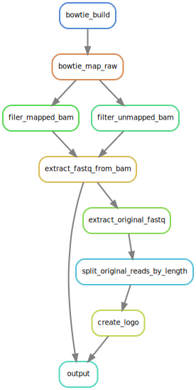
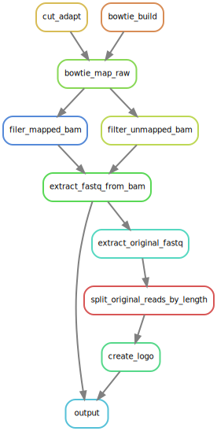

# Untemplated nucleotides search

Pipeline for detection of untemplated nucleotides from RNA-seq data

## Requirements
* cutadapt 2.8 with Python 3.8.10
* bowtie 1.2.3
* samtools 1.10
* graphviz 2.43.0
* seqtk 1.3
* BBMap and default-jre
* GPL Ghostscript 9.50
* weblogo 3.7.8

## How to run the pipeline on example dataset

```
cd example
snakemake -j 32 --snakefile ../Snakefile
```

For dry run without execution you can use
```
snakemake -j 32 --dry-run ../Snakefile
```

## General recommendations
I recommend you to keep the following directories structure
```
|-analysis_name
  |
  |-data
  |  |
  |  |-reference*
  |  |-reads*
  |
  |-configs
  | |
  | |-config.yaml*
  |
  |-results
    |
    |--iter_0
    |  |
    |  |-trimmed_reads
    |  |-alignments
    |  | |
    |  | |-mapped
    |  | |-unmapped
    |  | 
    |  |-fastq_from_alignments
    |  | |-mapped
    |  | |-unmapped
    |  | 
    |  |-original
    |    |
    |    |-mapped
    |
    |--iter_1
    |--iter_n
```

Folders ```data/reference``` and ```data/reads``` should be preexisting and specified in config file.

### Required files
```configs/config.yaml``` must containg all necessary information about pipeline parameters (see *example/configs/config.yaml*) 

```data/reference``` must contain reference genome in fasta format

```data/reads``` must contain reads in fastq format

Other folders will appear during the execution of pipeline.

### Outputs

```results/iter_*/trimmed_reads``` contains reads with 1 cuted base from 3' end

```results/iter_*/alignments``` contains all mapped results, including mapped and unmapped alignments in bam format

```results/iter_*/fastq``` contains fastq files extracted from bam

```results/iter_*/original``` contains original non-trimmed reads in fasta fromat and their sequence logos for each length specified in config file

## Create pipeline graph

```
snakemake --dag | dot -Tsvg > dag.svg
```

<p align="center">
  <h6>Without trimming</h6>
  
  <h6>With trimming</h6>
  
</p>

```
snakemake --rulegraph | dot -Tsvg > rulegraph.svg
```

<p align="center">
  
  
</p>
